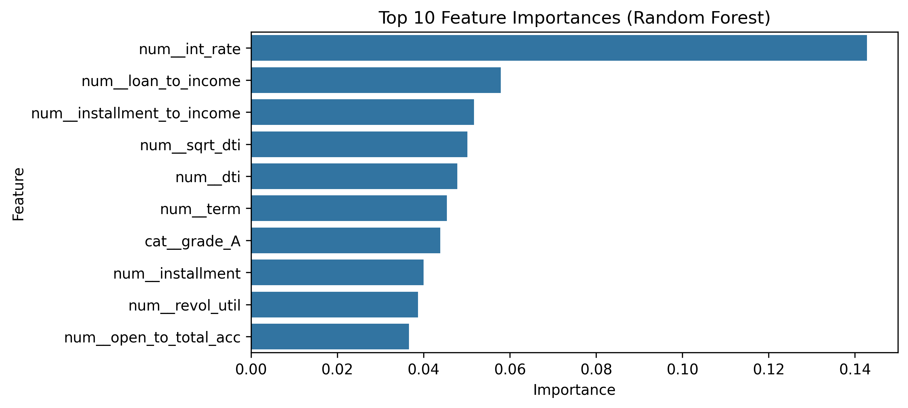
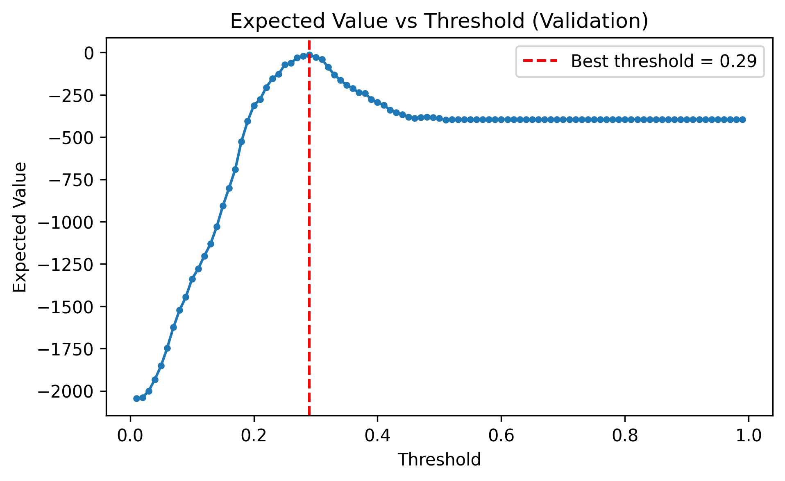
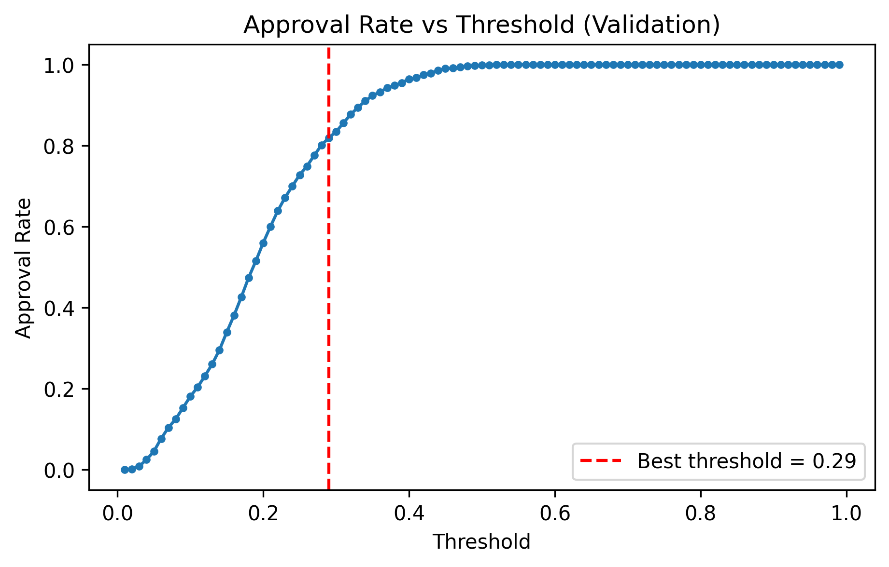

# Credit Risk Project Final Report

## Objective
This project builds a supervised machine learning model to estimate the probability of borrower default using historical loan data, enabling data-driven lending decisions.

## Data and Split Summary
- **Training Set**: 7596 samples.
- **Validation Set**: 2533 samples.
- **Stratification**: The split maintains the original target distribution (approx. 19.3% default rate) in both sets.

## Leakage Controls
- **Target Separation**: The target variable (`default`) was removed from the features (`X`) before any model training.
- **Identifier Removal**: Unique identifiers (like `id`) were dropped to prevent models from "memorizing" specific rows.
- **Hold-out Test Set**: `lending_club_test.csv` is an unlabeled hold-out file, never used for training, validation, or threshold tuning. All model selection is performed using a stratified train/validation split from the training data only.

## Final Model and Performance
- **Final Model**: Random Forest
- **Validation AUC**: 0.6954 (Measures ability to distinguish defaults from non-defaults)
- **AUC Gap**: 0.0777 (Difference between train and validation performance; monitors overfitting)
- **Validation RMSE**: 0.4625 (Measures probability calibration accuracy)

Detailed model comparisons can be found in [model_comparison_validation.csv](model_comparison_validation.csv).

## Threshold Decision Summary
To translate probabilities into approval/rejection decisions, we optimized the threshold to maximize expected value under conservative payoff assumptions (Defaults are 5x more costly than missed opportunities).

- **Optimal Threshold**: 0.58
- **Expected Value**: -21 (Total validation expected value under stylized payoff units: +1 approved non-default, −1 rejected non-default, −5 approved default, 0 rejected default)
- **Approval Rate**: 78.6% (Percentage of loans approved at this threshold)

## Key Visualizations

### Feature Importance
Shows the top 10 variables driving the model's predictions.

### Expected Value Curve
Shows how business value changes across different probability thresholds.

### Approval Rate Curve
Shows the trade-off between the classification threshold and the percentage of loans approved.

## Exported Artifacts
- [Model Comparison Metrics](model_comparison_validation.csv)
- [Threshold Sweep Results](threshold_sweep_validation.csv)
- [Threshold Sensitivity Analysis](threshold_sensitivity.csv)
- [Confusion Matrix (Threshold=0.50)](confusion_matrix_validation_050.csv)
- [Confusion Matrix (Optimal Threshold)](confusion_matrix_validation_optimal.csv)
- [Model Card](model_card.md)
- [Outputs Manifest](outputs_manifest.txt)
